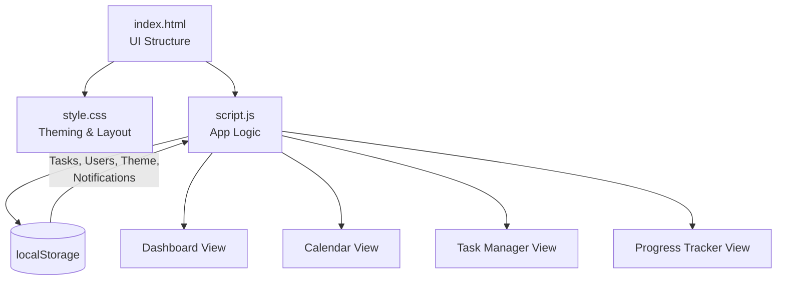

<div align="center">

# 📚 Smart Study Planner

### A sleek, all-in-one task & study management dashboard for students

[](https://developer.mozilla.org/en-US/docs/Web/HTML)
[](https://developer.mozilla.org/en-US/docs/Web/CSS)
[](https://developer.mozilla.org/en-US/docs/Web/JavaScript)
[](https://fontawesome.com/)
[](#)

[](LICENSE)
[](#)
[](#)

<br/>

*Plan smarter, not harder — track tasks, deadlines, and progress all in one beautifully simple dashboard.*

[🔗 Live Repo](https://github.com/nitishchauhan002/smart-study-planner) •
[Features](#-features) •
[Tech Stack](#-tech-stack) •
[Screenshots](#%EF%B8%8F-preview) •
[Quick Start](#-quick-start) •
[Roadmap](#%EF%B8%8F-roadmap)

</div>

---

## 📖 Overview

**Smart Study Planner** is a fully client-side, single-page web app that helps students organize their academic life — tasks, deadlines, calendar events, and progress — all in a clean, theme-able dashboard. No backend, no database setup: everything runs in the browser using `localStorage`, making it lightweight, fast, and easy to deploy anywhere (including GitHub Pages).

| | |
|---|---|
| 👤 **Author** | Nitish Kumar Singh ([@nitishchauhan002](https://github.com/nitishchauhan002)) |
| 🧪 **Category** | Web Technology / Frontend Project |
| 🏗️ **Architecture** | 100% Client-Side (HTML + CSS + Vanilla JS) |
| 💾 **Persistence** | Browser `localStorage` |
| 🌐 **Deployment** | Static — works on any web host / GitHub Pages |

---

## ✨ Features

- 🔐 **Auth Flow** — Login/Signup overlay with local user persistence
- ✅ **Task Manager** — Add, edit, search, filter (priority + status), and sort tasks
- 📅 **Interactive Calendar** — Month navigation with per-day task view
- 📊 **Progress Tracker** — Visual progress bar + subject-wise progress breakdown
- 🔔 **Reminder System** — Notification bell with unread count + notification history
- 📧 **Email Reminders** — Optional `mailto:` based email reminder support
- 🌗 **Dark/Light Theme Toggle** — Persisted theme preference
- 📱 **Responsive Dashboard** — Sidebar navigation, stat cards, and clean modal-based UX
- ℹ️ **About & Contact Sections** — Built-in informational pages

---

## 🧰 Tech Stack

<div align="center">

| Layer | Technology |
|---|---|
| **Structure** |  |
| **Styling** |  |
| **Logic** |  (Vanilla, no frameworks) |
| **Icons** |  |
| **Data Storage** | Browser `localStorage` (no backend required) |
| **Version Control** |   |

</div>

---

## 🏗️ Architecture



**Core modules inside `script.js`:**
- 🔑 Auth (login / signup / session via `localStorage`)
- 🗂️ Task CRUD (create, search, filter, sort, status tracking)
- 📅 Calendar rendering with month navigation
- 🔔 Reminder & notification history engine
- 📊 Progress computation (overall + per-subject)
- 🌗 Theme persistence (dark/light)

---

## 📁 Project Structure

```
smart-study-planner/
├── 📄 index.html        # Main application (multi-section SPA)
├── 📄 dashboard.html     # Lightweight standalone dashboard view
├── 🎨 style.css          # Global styles & theming
├── ⚙️ script.js          # Application logic (tasks, calendar, auth, reminders)
├── 📜 LICENSE            # MIT License
└── 📘 README.md
```

---

## 🚀 Quick Start

### 1️⃣ Clone the repository

```bash
git clone https://github.com/nitishchauhan002/smart-study-planner.git
cd smart-study-planner
```

### 2️⃣ Run it — no build step needed!

Simply open `index.html` in your browser:

```bash
# macOS
open index.html

# Windows
start index.html

# Linux
xdg-open index.html
```

Or serve it locally for a better experience (recommended for relative paths & live reload):

```bash
npx serve .
# or
python -m http.server 8000
```

Then visit `http://localhost:8000`.

### 3️⃣ Get started in-app

1. Sign up / log in (stored locally in your browser)
2. Add tasks with subject, deadline, and priority
3. Track progress from the **Progress** tab
4. Set up an optional reminder email
5. Toggle dark/light mode from the sidebar 🌙

> 💡 All data is stored in your browser's `localStorage` — clearing browser data will reset tasks, users, and settings.

---

## 🖥️ Preview

| Dashboard | Tasks |
|---|---|
| 📊 Stats cards, progress bar, notification history | ✅ Add/search/filter/sort tasks by priority & status |

| Calendar | Progress |
|---|---|
| 📅 Month navigation with per-day task view | 📈 Overall + subject-wise progress charts |

*(Add your own screenshots/GIFs here for a more visual README!)*

---

## 🗺️ Roadmap

- [ ] ☁️ Add a real backend (Node/Express + DB) for cross-device sync
- [ ] 🔔 Browser push notifications for deadlines
- [ ] 📱 Convert into a PWA for offline/mobile use
- [ ] 🔐 Replace plaintext localStorage auth with secure backend authentication
- [ ] 📤 Export tasks as CSV/PDF
- [ ] 🎯 Recurring tasks & study streak tracking

---

## 🤝 Contributing

Contributions are welcome!

1. Fork the repo
2. Create your feature branch (`git checkout -b feature/amazing-feature`)
3. Commit your changes (`git commit -m 'Add amazing feature'`)
4. Push to the branch (`git push origin feature/amazing-feature`)
5. Open a Pull Request

---

## 📄 License

This project is licensed under the **MIT License** — see the [LICENSE](LICENSE) file for details.

---

## 👤 Author

<div align="center">

**Nitish Kumar Singh**

[](https://github.com/nitishchauhan002)
[](https://www.linkedin.com/in/nitish-kumar-singh-4802792bb/)

⭐ If this project helped you, consider giving it a star on [GitHub](https://github.com/nitishchauhan002/smart-study-planner)!

</div>
